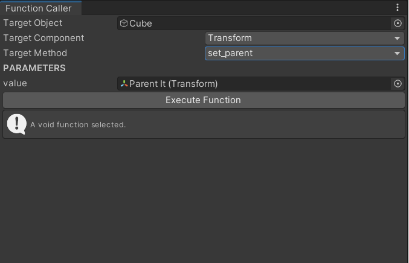

# 
Function Caller

Function Caller allows you execute functions with given parameters on unity editor.

## Installation
Add <b>FunctionCaller.cs</b> to you project
Window -> Funciton Caller

## Features

- Execute with parameters
- Unlimited parameter count
- See output on window
- Accepts all classes inherit from UnityEngine.Object as a parameter.
- Accepts, Vector3, int, float, bool, Vector4, EulerRotation as a primitive data types as parameters.

## How to use

* Open FunctionCaller window with Windows -> FunctionCaller
* Drag and Drop gameobject to TargetObject section
* Select component and function
* Give parameters if there is any
* Execute

## Limitations & Further development

* Arrays or Lists are not allowed as a parameter.
* Executing more than one function at a time is not possible.

